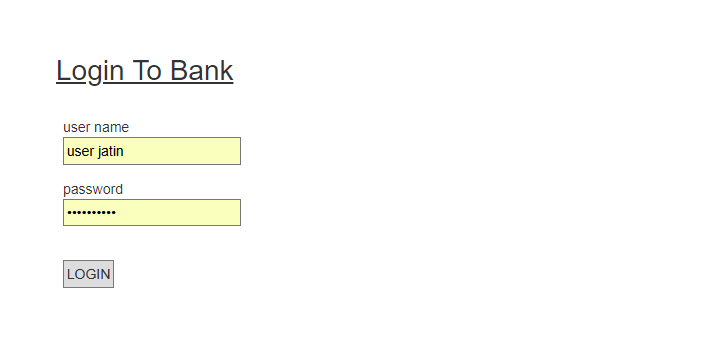
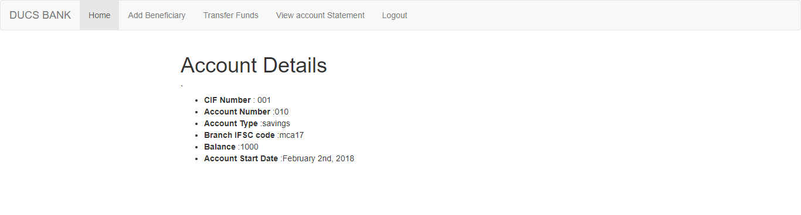
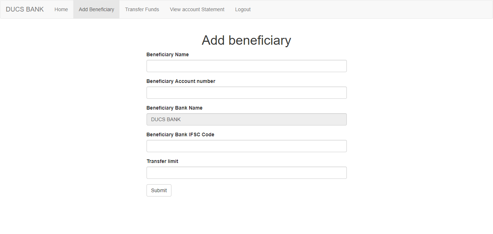
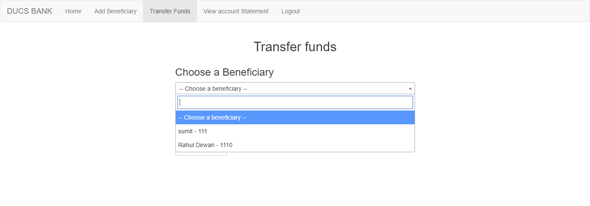
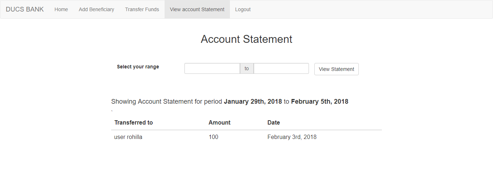
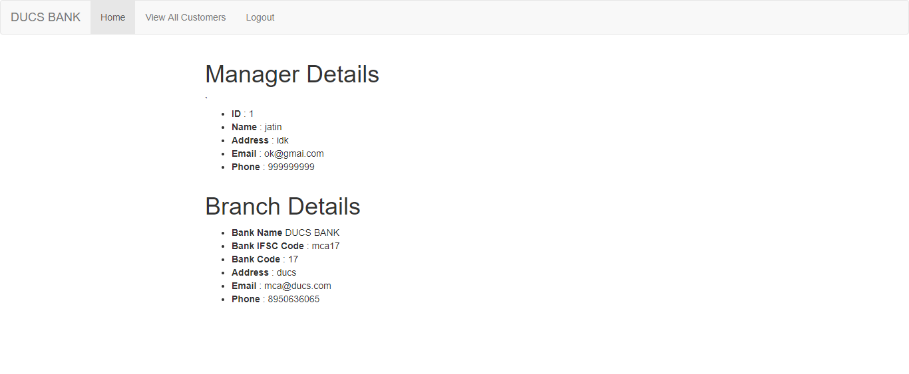
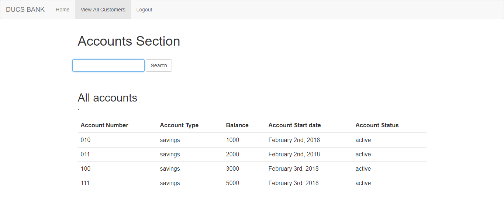

# Banking-App
A Basic Banking App Using PHP

# Online Banking System

- Basic php project with little Bootstrap and a few plugins as required.
- made overnight for Intra sankalan web dev event
- Can be used for basic references, but should not to be used for production.
- Database can be improved by investing time.

## Test Stack
- Xampp stack v3.2.2  
- PHP 7.1 , MYSQLi 5.0
- Netbeans 8.x and sublime text 3.x
- MySQL workbench
- chrome 64

## 🏁 Getting Started 

### Prerequisites

To set this web application, make sure PHP and PHPMyAdmin is installed on your server.

### Installing

1. Open PHPMyAdmin, create a database name 'bank_db' and import the bank_db.sql file. This will generate tables in your database on your server.

2. Once this is done, go to the url of your website and it should be up and running.

Admin site on : http://localhost/online-banking/site/dist/
 
Customer site on : http://localhost/online-banking/admin/dist/

- Make sure this project in 'online-banking' named directory for direct access from this urls.

## Screenshots

#### Login Page

#### Customer Portal

#### Manager Portal

